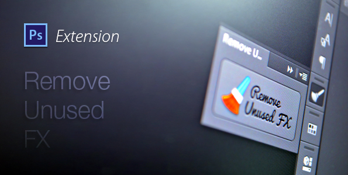
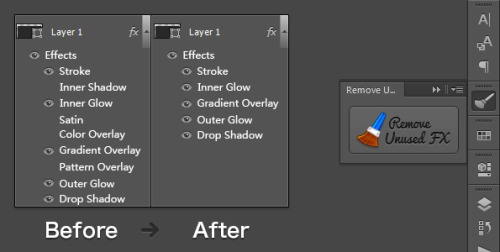
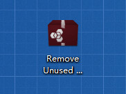

#Remove Unused FX
###Photoshop Extension

---

Clean up your photoshop files

Let the OCD & Neat-freaks feel more comfortable!!

Screen Shot
---

Features
---

by the way the codes is from this [feedback](http://feedback.photoshop.com/photoshop_family/topics/photoshop_feature_request_remove_unused_layer_styles)

Install
---

Open this .zxp to install it,

double click it and Adobe extension manager should show up automatically .

it's easy,i'm you can do it.

Last step
---
After installed, you have to find it in the photoshop menu:
####` Window -> Extension -> Remove Unused FX `

Usage
---

JUST HIT THE F**KING BUTTON.  

ヽ(#`Д´)ﾉ

license
---
No license of course.

one more thing
---
I didn't try to test it on CS5 yet,

So i'm not sure what will happen on cs5.

CS6 is fine.